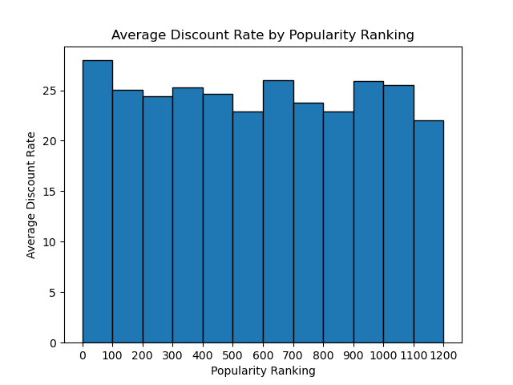
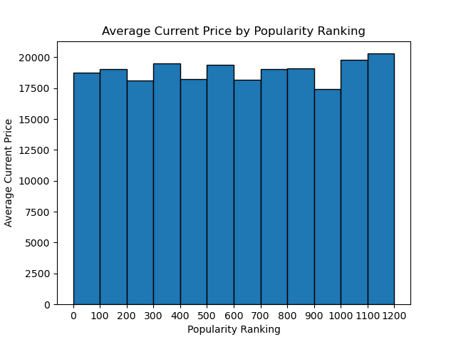
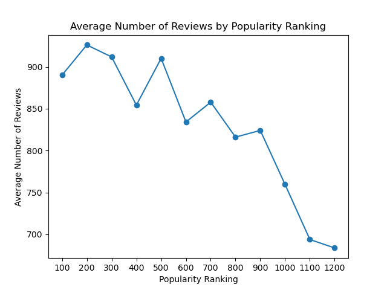

# Report
This data analysis is centered around the popularity of products. High popularity indicates the most sold products, and likely, all sellers contemplate how to maximize the sales of their products. Thus, starting from the fundamental question of how products can gain popularity, it explores the correlation between various factors and the popularity of products.

## 1. Data Manipulation

- Convert relevant columns from string to numeric values.
- Calculate the 'discount price' by subtracting the 'current price' from the 'original price'.

- Calculate 'discount rate' by subtracting the 'current price' from the 'original price', dividng the result by the 'original price', and then multiplying by 100.

- Removed the '+' sign from the 'number of reviews' and replaced NaN values with 0.

- Derived 'popularity ranking' by adding 1 to the index.

## 2. Visualization & Analysis
### - Does a higher discount rate lead to higher popularity?

The horizontal axis, representing popularity ranking, indicates that lower numerical values correspond to higher popularity. The data has been grouped into intervals of 100 for popularity ranking. The vertical axis represents the average discount rate for each group.

Upon examining the graph, it is observed that the group with the highest popularity ranking, 1-100, exhibits the highest average discount rate, while the group with the lowest popularity ranking, 1101-1200, shows the lowest average discount rate.

In terms of overall trends, certain intermediate groups such as 601-700, 901-1000, and 1001-1100 demonstrate higher discount rates. However, it is evident that, in general, as the popularity decreases, the discount rate also tends to decrease. This implies that products with higher discount rates tend to have higher popularity.

### - Does a higher current price lead to higher popularity?

The horizontal axis, representing popularity ranking, indicates that lower numerical values correspond to higher popularity. The data has been grouped into intervals of 100 for popularity ranking. The vertical axis represents the average current price for each group.

Upon examining the graph, it is observed that the average current price is lowest when the popularity ranking is in the range of 901-1000. There is little difference between popularity rankings that are high or moderate, indicating a relatively weak correlation. However, when the average current price is highest, the popularity ranking is in the lowest range, 1101-1200.

This suggests that while current price may not have a significant impact on popularity for most popularity rankings, the average current price is higher for products with the lowest popularity rankings.

### -Does having a large number of reviews lead to higher popularity?

The horizontal axis, representing popularity ranking, indicates that lower numerical values correspond to higher popularity. The data has been grouped into intervals of 100 for popularity ranking. The vertical axis represents the average number of reviews for each group.

However, it is important to note that when calculating the average, reviews with 999 or more were assumed to be 999, potentially leading to imprecise information about the average number of reviews.

Upon examining the graph, it is evident that the popularity ranking with the highest average number of reviews is in the range of 101-200. Conversely, the lowest average number of reviews corresponds to the popularity ranking of 1101-1200. Overall, the graph indicates a decreasing trend in the average number of reviews as the popularity ranking decreases. However, there are instances, such as the 401-500 ranking, where the number of reviews is relatively high.

## 3. Results
Exploring the correlation between three factors affecting product popularity, it can be inferred that the current price does not significantly impact the popularity ranking. However, there seems to be a slight correlation between the discount rate and popularity ranking, while the number of reviews appears to have a substantial influence on the popularity ranking. Consequently, to increase product sales, activities such as boosting the number of reviews or offering higher discounts could be considered effective strategies.